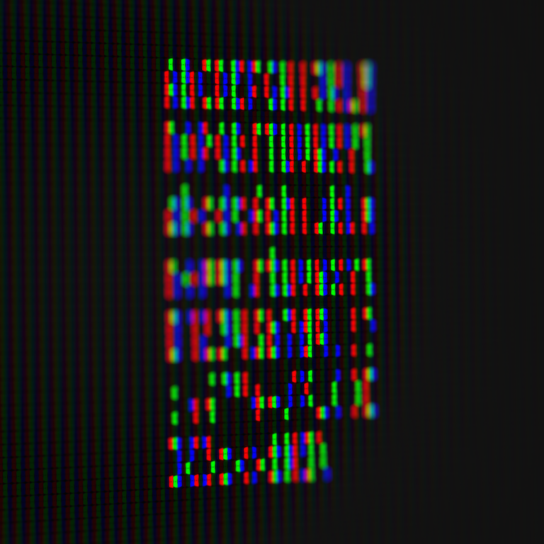
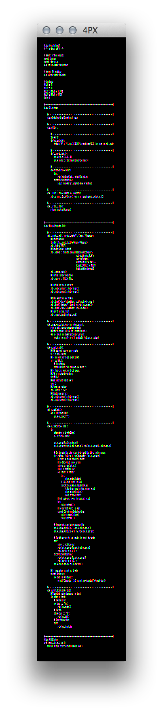

The world's smallest legible typeface on LCD displays, uses sub pixels to draw
its 88 glyphs on screen.

This repo containes the multi-platform editor: Python based Tcl/Tk GUI and
logic; and the "font file".

